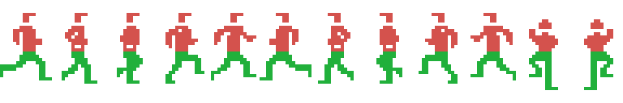

# The code

## Everything happens inside the interrupt

The main program is two bytes: a jump to itself, at 0x80F5. The game runs in
the H.KEYI hook, which the BIOS calls on every screen refresh and which always
does the same thing (0x80F7-0x8100):

    B249   both joysticks, through the sound chip
    B26E   keyboard row 8, remapped into joystick format
    B35B   the chain of sound vectors
    9A6F   the frame: the screen and the objects

and after that, at 0x8103, the 0x54 bytes at 0xE26A go to video memory 0x1B00:
the whole sprite attribute table, once per frame.

## And it never returns to the BIOS

The end of the hook is not a normal `ret`: it is eleven `pop`s in a row
(0x810F-0x8122) that unstack what the BIOS saved on entering the interrupt
—including the alternate registers, after the `ex af,af'` and `exx` at 0x8118—
with an `in a,(099h)` in the middle (0x811A) that reads the video chip status
and acknowledges the interrupt.

The first `pop hl` eats the return address to the BIOS, and the `ei` / `ret`
at 0x8123 hands control straight back to the interrupted program. The rest of
the BIOS interrupt routine never runs.

## The frame

0x9A6F, in order:

1. the game clock (0x9DB8);
2. the screen edge (0x9CBE): if the player reached it, the scene changes and
   the frame ends there;
3. if 0xE221 is non-zero the demo is running, and the input is replaced by the
   recording at 0xE259 (0x9A7E);
4. the walk over the live objects (0x9A88);
5. the two sprites above the player (0x9D03);
6. the close (0x9AE0): system keys and the idle timer.

## The character is three sprites, one per colour

An MSX1 sprite is one colour, so a three-colour player is three sprites. 0x9D03
builds the other two from the main one: same X, **16 pixels higher**, with
patterns (P-0x20)+0x68 and (P-0x20)+0xB0. The colours are written by the scene
setup: 0x0C at 0xE2A5, 0x06 at 0xE2A9 and 0x0F at 0xE2AD. `reaparece` zeroes
them to hide the character (0x8247) and turns them back on at different times
(0x82D4-0x82E1): that is the flicker.

Harry is 16x32 and the layers are not exact overlays: the two upper sprites
overlap each other —two colours in the top half— and the main one sits below,
one colour for the legs. Rebuilt from the dumped video memory
(`tools/render_jugador.py`), this is the strip of the twelve frames named by
the cartridge's own animation scripts:

The timings are the cartridge's too: walking is five frames of three ticks each
(0x8AE1) and climbing two frames of one tick (0x8AF9). Walking left uses
patterns 0x44-0x54 (0x8AED), the exact mirror of 0x20-0x30, checked pixel by
pixel. The two standing patterns, 0x34 and 0x58, come from no script: `se_para`
sets them by hand (0x8970 and 0x896B), which is why they are not in the strip.

On the TMS9918 **the lower-numbered sprite is in front**, so the one at 0xE2A6
covers the one at 0xE2AA. It matters in the two climbing frames, the only ones
where the two upper layers overlap: five pixels each, which with the order
reversed would come out white instead of red.

The speed: `anda` (0x88ED) writes 0x00C8 —200/256, 0.78 pixels per frame— and
0xFF38 the other way, the same number negated.

The emulator dump agrees: three sprite entries at 0xE2A2 with the same X, Y 109
for the main one and 93 for the other two, patterns 0x34, 0x7C and 0xC4 —
exactly 0x34, (0x34-0x20)+0x68 and (0x34-0x20)+0xB0—.

## The objects: six bytes per axis, and one counter each

0xE247 says how many objects are alive, followed by one pointer per object.
Each object's counter (+0x11) is decremented and **only when it hits zero** is
it reloaded with the period (+0x10) and the object served (0x9A99): every
object runs at its own pace from a single loop.

The structure, read from the walk at 0x9A88:

| | |
|---|---|
| +0x00 to +0x05 | flags, 16-bit speed, the two limits and the fraction — one axis |
| +0x06 to +0x0B | the same for the other axis |
| +0x0C / +0x0D | the animation script |
| +0x0E / +0x0F | the animation counter and the current frame |
| +0x10 / +0x11 | the period and its count |
| +0x12 / +0x13 | its handler |
| +0x14 / +0x15 | where its sprite attributes are |

That the two movement blocks are identical is visible in the code: 0x9AB3 calls
the move routine, 0x9AB9 adds **six** to IX, and 0x9ABD calls the same routine
again.

The position is not in the structure: the integer part lives directly in the
sprite attribute (0x9B24), and only the fraction stays in the structure, at
+0x05. Moving an object is adding its speed to a 16-bit number whose high byte
is what the video chip sees.

The per-axis flags (0x9B1F):

| | |
|---|---|
| bit 0 | it moves |
| bit 1 | on reaching a limit it bounces instead of stopping (0x9B5A) |
| bit 2 | it has limits, at +0x03 and +0x04 |
| bit 5 | it is animated (0x9AEC) |
| bit 6 | it has its own handler (0x9AC2) |

## Four dispatchers, all with the same trick

Jumps to computed addresses stack the return by hand: `ld de,<back>` /
`push de` / `jp (hl)` (0x9AD2, and 0x9F89 the same). The return addresses are
declared as tracer entry points.

| What it picks | Where | Index | Table |
|---|---|---|---|
| an object's handler | 0x9AD6 | the object itself, +0x12/+0x13 | none |
| the kind of scene | 0x9F81 | 0xE225, 0 to 7 | 0xAEB4 |
| the scene's variant | 0xA99F | 0xE224, 0 to 7 | 0xAE94, 0xAEA4 or 0xAEC4, per caller |
| what happens on contact | 0x873B | the box class, 0 to 10 | 0x8AA0 |

The variant one takes the table in HL: the same routine serves three tables,
and the caller decides which. The one at 0xAEA4 is only loaded by 0xAE2E, and
only with scene kind 5.

## The collision boxes

0xE229-0xE246 are ten three-byte records: class, left X and right X. The scene
routines write them when the screen is set up, and 0x84EF, 0x8529 and 0x8589
walk them with the player's X plus eight —his centre—.

The first seven belong to the surface and those from 0xE241 on to the
underground (0x853A). The class goes straight to the dispatcher at 0x873B:

| | | |
|---|---|---|
| 0 | off | jumps nowhere |
| 1 | log | 0x8640: knocks down and drains points |
| 2 | ground | 0x8751: the way down to the underground |
| 3 | pool | 0x8361: sinks you |
| 4 | crocodile | 0x8361: the same place |
| 5 | vine | 0x8162: hooks you |
| 6 | kills | 0x8221 |
| 7 | — | points to 0x874B, and nobody ever writes it |
| 8 | treasure | 0x878C: adds it up |
| 9 | kills | 0x8221 |
| 10 | bounce | 0x85EF: reverses your run and pushes back. **Not the ladder** |

Classes 2, 3 and 4 also push the player **sideways** out of the box
(0x8555-0x8578): what is adjusted is his X; nothing touches the Y there.

## The world is not stored: it is computed

The scene you are in **is** the content of 0xE222, an 8-bit feedback shift
register. 0xB68F steps it forward and 0xB69F steps it back with the exact
inverse function: leaving left undoes what right did. All eight bits are used:
6-7 the scenery (0x9F91), 3-5 the kind (0x9EFB), 0-2 the variant (0x9EEF).

The detail, with why there are exactly 255 screens, is in
[Findings](FINDINGS.html).

## Drawing a scene

0x9EE6 is the only path that builds a screen: poking 0xE222 repaints nothing.
It reads the scenery, kind and variant from the register, then builds:

- **the layout**, one block from the table at 0xA08E consumed by 0x8D70: 0x71
  raw bytes for rows 4 to 7, one 0x20-byte row painted six times, five bytes
  for the strips of rows 12 and 13, and a cell script. The four layouts each
  end where the next begins;
- **the 16-tile scenery set**, from the table at 0xA086;
- **the cell scripts** (0x9FE6): the first byte says how many cells, the second
  is skipped —0x9FE7 and 0x9FE8 are two `inc hl`—, then four-byte records with
  the name-table position and the tile. That draws the ladder, the floor bands
  and the 3x2 objects on the right.

The floor strips save two bytes per strip: the layout byte is **at once**
offset into the table, copy length and video memory advance (0x8DA7). Each
strip copies from `tabla+N` to `tabla+2N`.

## The input: two joysticks and a keyboard in the same byte

0xB249 reads both joystick ports through the sound chip into 0xE05F and 0xE061
—with a `cpl` at 0xB257, because the chip delivers them inverted—. 0xB26E takes
keyboard row 8 —space bar and cursors— and remaps it bit by bit: three rotates
and an `and 0x1F` (0xB28F) leave bit 0 up, 1 down, 2 left, 3 right, 4 fire.

Both sources end in the same place with the same shape, so the rest of the game
cannot tell which you use. The demo exploits it: it writes the recorded input
into 0xE05F (0x9A7E).

## The sound never touches the chip: it touches fourteen bytes of RAM

0xE20E-0xE21B is a copy of sound chip registers 0 to 13, and 0xB37B uploads it
whole with an `outd` loop, once per frame. Outside it, port 0xA1 is written in
only two places (0xB24F, 0xB261), and not for sound: it is register 15, the
joystick port selector.

On top sit four vectors at 0xE1E6-0xE1ED. Requesting a sound is calling 0xB32E
with a number from 0 to 10; the table at 0xB393 —[slot][pointer] records— says
which slot it installs into and with which routine, and the slot fixes the
channel. Every frame, 0xB35B calls whatever is installed in the first three.

There are two engines and three hand-written effects. The one at 0xB3F0 reads
eight-byte scripts and sweeps pitch and volume together, with a fractional part
at 0xE1FC of which only the high byte comes out (0xB471); the one at 0xB5EA
reads four-byte scripts and holds each note still. The three without a script
—0xB49F, 0xB4E6, 0xB52E— carry the sweep in the code: 19 frames raising the
period by 0x14, three frames lowering it by 0x7F —or 0x80: the `sbc` at 0xB528
takes the carry and nothing clears it— and one frame of noise.

## The vine is traced, not drawn

There is no drawing of a vine in the cartridge. On each step, 0xA471 traces a
16-point straight line onto a 0x40-byte bitmap in RAM (0xE18A) and uploads it
to video memory as a sprite pattern (0xA594). The slope comes from the table at
0xA61A —33 four-byte records— indexed by the phase of the swing, 0xE1CB, which
runs back and forth between 1 and 0x20 (0xA5EF).

The four bytes of each phase:

| byte | what it is | from vertical to the tip |
|---|---|---|
| 1 | the slope, in 1/256 pixel per row | 0x00 → 0xC9 |
| 2 | the object's **period** (0xA48F) | 1 → 9 frames |
| 3 | where the rope ends and you grab it (0xA529) | 0x10 → 0x06 |
| 4 | which step of the jump curve the fall starts at on letting go (0xA546) | 0x00 → 0x10 |

Since the period grows towards the tips, **the swing rushes through the middle
and brakes at the ends**, like a pendulum: no physics, one column of a table.
Half a swing is the 32 periods added up, 75 frames.

The rope is not the 48 rows of its three sprites: the third one carries pattern
0x60, which 0xA551 builds by copying from the first only as many rows as the
third byte says, so the rope **ends at the grab point** and shortens as it
leans: 48 rows vertical, 38 at the tip.

Reproducing the tracer with the same data (`tools/render_liana.py`) gives the
33 phases:

The bottom edge is each phase's grab point, which is why the outer ones end
higher. Against an emulator capture, the rope lands **0.28 pixels on average**
from where the model puts it (the matching phase is 0x1C); even the steps
repeat, because the machine restarts the accumulator on each sprite and drops
the fraction every 16 rows.

While you hang, the vine writes your X and Y (0xA5F9), with a drawing of its
own: pattern 0x40, or 0x64 facing left (0x819A). Letting go is pressing down
(0x81A7).

## The jump is a table, not a speed

The jump starts at 0x87E9 and the step is kept at +0x17 of the player's
structure. In the air (0x8820) that number counts from 0x1F to 0 and indexes
the curve at 0x8AB6, read from the end backwards: 0xFF goes up one pixel, 0x01
down one, 0x00 holds (0x8835). There is no vertical speed anywhere: there is a
table.

From 0x1F to 0x11 the curve rises ten pixels and from 0x10 to 1 it drops them
ever closer together: 31 frames, 15 up and 16 down. **Letting go of the vine
uses the same curve but does not start at 0x1F**: it starts at the fourth byte
of the swing phase (0x821A), which never goes past 0x10 —exactly the falling
half—, so letting go only ever falls. At the vertical it is 0 and you land at
once (0x882E); at the tip it is 0x10, the whole descent.

Turning in the air is only possible in the first three steps (0x8896), and
doing so recovers the ground lost by changing direction (0x88C3).
